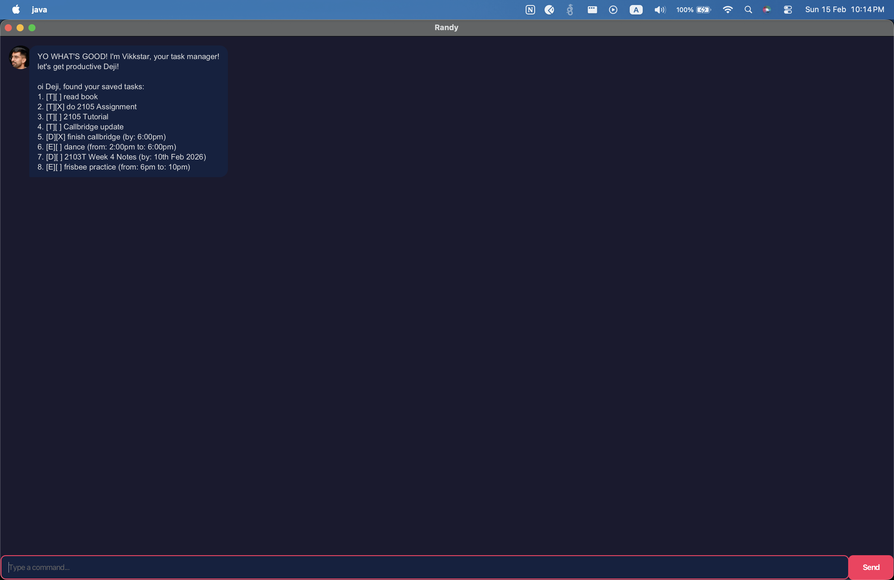

# Randy User Guide

Randy is a chatbot that helps you manage your tasks. He tracks todos, deadlines, and events so you don't have to remember everything yourself.



## Quick Start

1. Make sure you have Java 17 installed.
2. Download the latest `randy.jar` from the releases page.
3. Run it with `java -jar randy.jar`.
4. Type commands and hit Enter!

## Features

### Adding a todo: `todo`

Adds a simple task with no date.

Example: `todo read book`

```
added:
[T][ ] read book
you now have 1 tasks
```

### Adding a deadline: `deadline`

Adds a task with a due date. Dates in yyyy-MM-dd format get formatted nicely.

Example: `deadline submit report /by 2025-03-01`

```
added:
[D][ ] submit report (by: Mar 01 2025)
you now have 2 tasks
```

### Adding an event: `event`

Adds a task that spans a time range.

Example: `event project meeting /from 2025-03-01 /to 2025-03-02`

```
added:
[E][ ] project meeting (from: Mar 01 2025 to: Mar 02 2025)
you now have 3 tasks
```

### Listing tasks: `list`

Shows all your current tasks.

Example: `list`

### Marking a task: `mark`

Marks a task as done.

Example: `mark 1`

### Unmarking a task: `unmark`

Marks a task as not done.

Example: `unmark 1`

### Deleting a task: `delete`

Removes a task from the list.

Example: `delete 2`

### Finding tasks: `find`

Searches for tasks containing a keyword.

Example: `find book`

### Filtering by date: `on`

Shows tasks happening on a specific date.

Example: `on 2025-03-01`

### Exiting: `bye`

Exits the application.

Example: `bye`

## Data Storage

Tasks are saved automatically to `./data/storage.txt`. If the file is missing or corrupted, Randy starts with an empty list.
